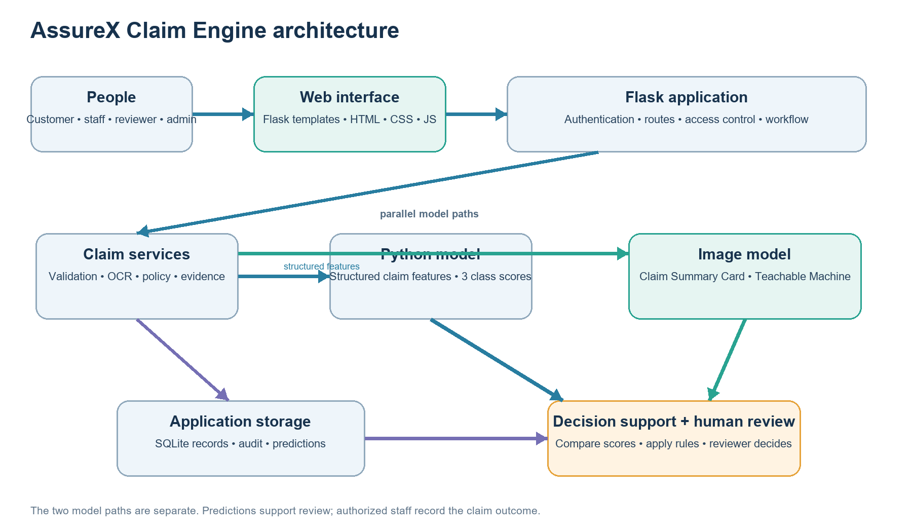
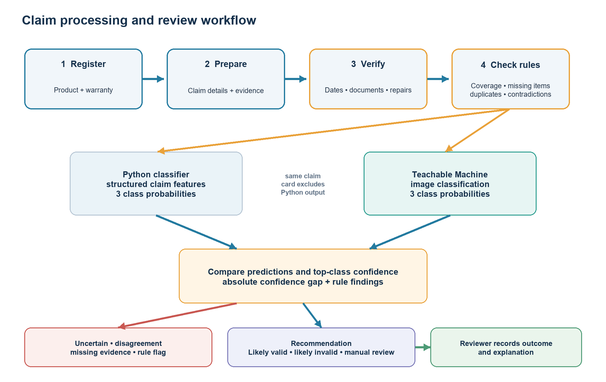
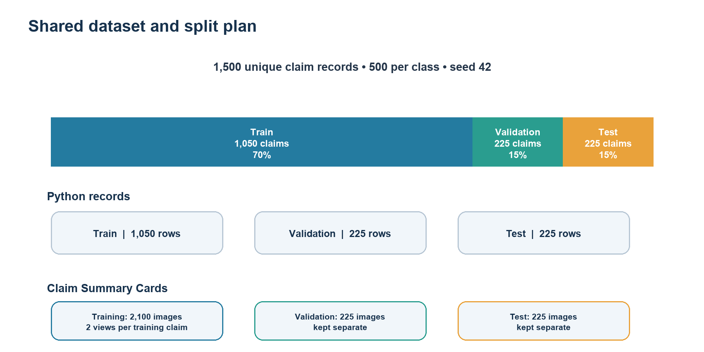
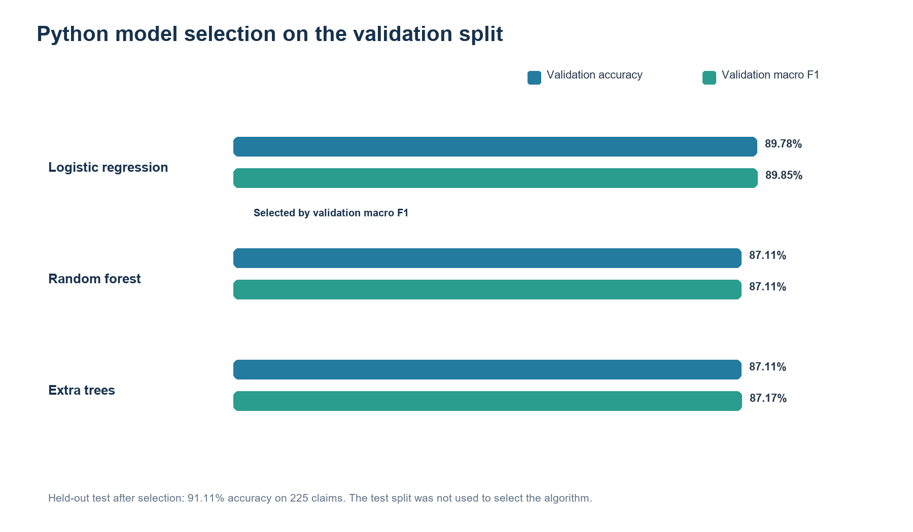
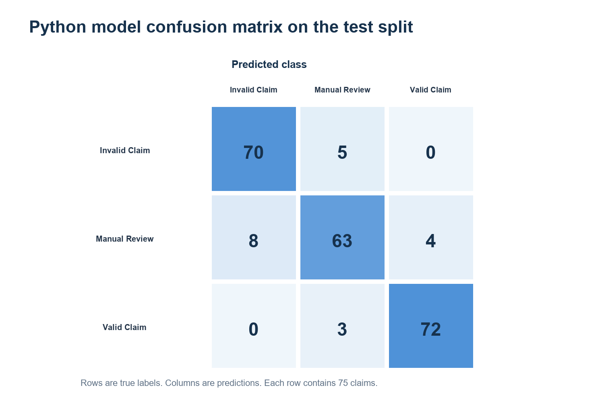
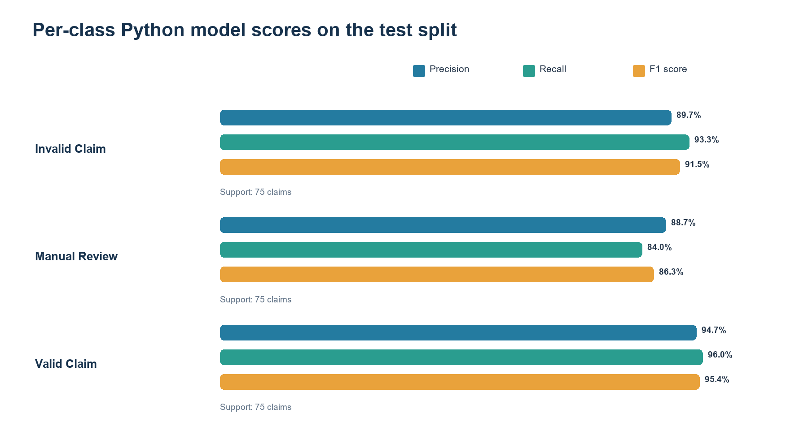
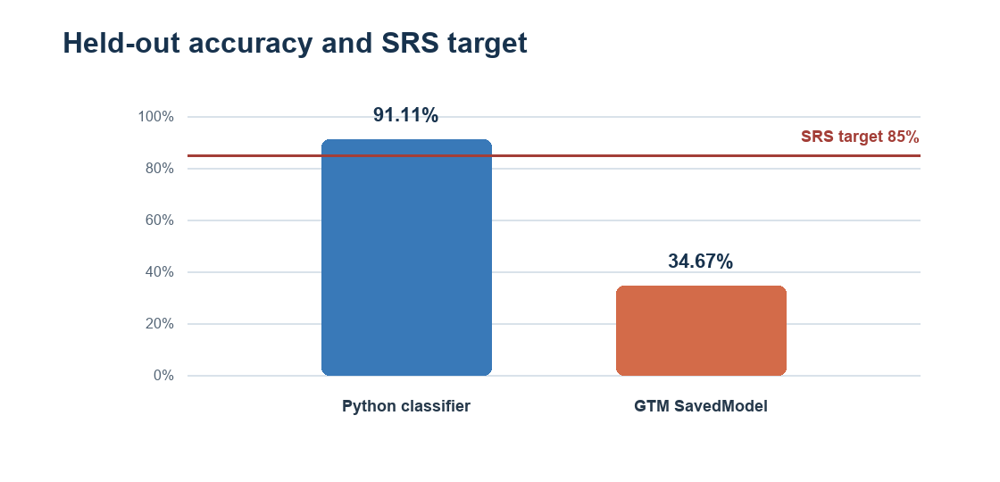
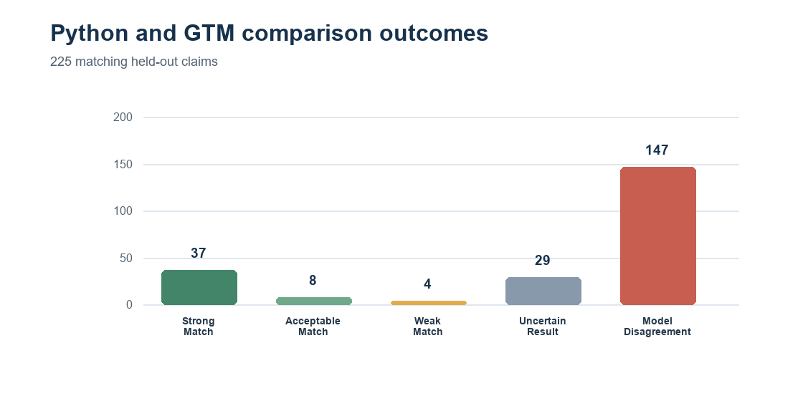
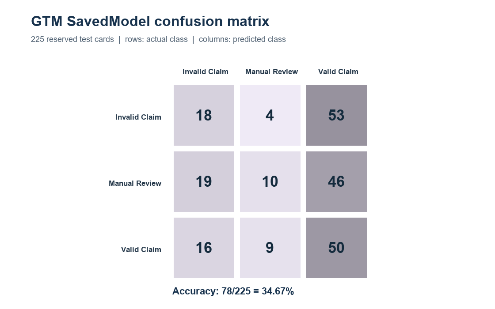
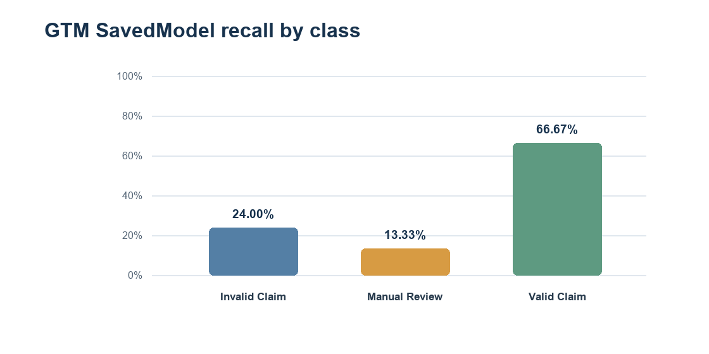

# AssureX Claim Engine: A Practical Approach to Warranty Claim Review

*How our student team built and tested a warranty-claim review prototype, and what the results taught us.*

We chose warranty claims because the decision depends on more than whether a product has a fault. A reviewer may need to connect a purchase date, serial number, warranty terms, fault date, repair history, receipt, and photographs. When those details arrive in different forms and files, even a straightforward claim can take time to verify.

As students, we wanted to explore how software could make those checks easier to follow without pretending that a model can settle every case. We built AssureX Claim Engine as a web prototype for product registration, warranties, claim intake, evidence review, and claim tracking. It combines configurable warranty rules, document extraction, a Python classifier, and a GTM SavedModel image classifier. The final decision stays with an authorized human reviewer.

This is a project prototype, not a deployed insurer system. We did not validate it on a production insurer’s records. That boundary matters when interpreting the results later in this article.

## Why warranty review needs a structured process

A reviewer is not simply deciding whether a product is broken. They need to know whether the product was covered when the fault happened, whether the fault is included in the policy, and whether the evidence belongs to the product being claimed. They may also need to check for previous repairs, missing documents, possible duplicates, or conflicts between a receipt and the registered product details.

If these checks are performed from memory or across separate spreadsheets and folders, important information can be missed. Two reviewers may interpret the same policy differently. A claim may wait while someone asks for a receipt that was already uploaded under the product record. A mismatch between a serial number and a warranty card may not become visible until late in the process.

The AssureX requirements specification describes a web-based application that brings claim intake, document handling, warranty rules, model support, and review tracking into one place. This is a decision-support problem. A good system should make the evidence easier to inspect and explain why a claim needs attention. It should not make an uncertain case look certain just because a model returned a high score.

## What AssureX does

We built the application with Python and Flask. Its pages use HTML templates, CSS, JavaScript, and Bootstrap styling. SQLite stores application records, while uploaded evidence is kept in a private upload directory. We added customer, service-centre employee, reviewer, and administrator roles with role-based access checks.

A customer can register a product, add warranty information, attach documents, and create a claim linked to the product and warranty. The claim form collects information such as the fault date, fault category, damage type, requested amount, description, and relevant repairs or replacements. The reviewer can inspect rule findings and evidence, request more information, record an outcome, and leave a reason in the claim history.

The application also provides dashboards, search and filters, notifications, CSV exports, and a downloadable HTML claim report. These features do not replace a careful review, but they help people find the current state of a claim and the information already recorded about it.

*Figure 1. AssureX application architecture. The model outputs support a recommendation; an authorized reviewer records the claim decision.*

## From claim intake to review

The workflow begins with a product and a warranty record. A user creates a claim, enters the event details, and uploads supporting files. The application validates form fields, dates, numbers, and file types. Document extraction can propose information from an image or text-based PDF, and the user can review and correct those values before relying on them.

The system then checks the claim against configured warranty rules and evidence requirements. It can flag missing mandatory documents, an expired warranty, an excluded damage type, a serial-number mismatch, a possible duplicate, or a contradiction between the uploaded evidence and the product record. Repair history is available as another piece of context.

If model results are available, the application records the Python prediction and the GTM SavedModel prediction with their model versions and class scores. It compares their predicted classes and top-class confidence values. Low confidence, disagreement, incomplete evidence, or rule findings can keep the claim in manual review. A reviewer can request more information, approve, reject, or close the claim according to the workflow and their permissions.

*Figure 2. Claim processing flow. The models are evaluated in parallel, and the reviewer remains responsible for the recorded outcome.*

## Building a shared dataset

For the prototype, we worked with 1,500 structured claim records. The classes are balanced: 500 Valid Claim records, 500 Invalid Claim records, and 500 Manual Review records. The records are separated into three splits: 1,050 training claims, 225 validation claims, and 225 test claims. Each split contains 75 claims from each class in the validation and test sets, and 350 from each class in the training set.

The dataset fields cover product and purchase details, warranty length and status, fault category, damage type, claim amount, repairs, evidence availability, serial matching, duplicate indicators, contradictions, product age, and time remaining on the warranty. This gives the model a structured view of the information a reviewer may need to consider.

The same claim identities are represented in the Claim Summary Card manifest. Training has two visual versions for each training claim, or 2,100 training images. The validation and test cards are kept separate, with 225 cards in each split. Keeping all versions of a claim in one split matters. Otherwise, a model could see a variation of a test claim while training and appear more accurate than it is on unseen cases.

The records are balanced, but balance does not prove that the examples represent real customer claims. The repository contains the CSV files and split map, while the original process used to create and label the full dataset is not fully documented in the current checkout. Before publication or operational use, the team should record whether the examples are synthetic, how scenarios and labels were chosen, and how representative they are of real warranty policies.

*Figure 3. The 70/15/15 split keeps training, validation, and test claims separate. Training cards have two image variations per claim.*

## Preparing features for the Python model

The Python classifier receives a fixed set of 35 features. Examples include product category, brand, retailer, purchase price, warranty duration, fault type, damage type, claim amount, previous repairs, whether required documents were uploaded, serial-number matching, duplicate and contradiction flags, product age, remaining warranty days, and the ratio between claim amount and purchase price.

The training script handles numeric and categorical features separately. It fills missing numeric values using the median and scales numeric values. It fills missing categories using the most common value and encodes categories with one-hot encoding. These operations are kept inside a scikit-learn pipeline so the training and inference paths can use the same transformations.

This preparation is important because models expect consistent inputs. A date needs to become a meaningful number of days. A category such as “Smartphone” must be represented consistently. An unknown category at prediction time should not cause the whole model pipeline to fail. The application also maps current product, claim, verified document, repair, and policy information into the model's feature order.

## Comparing Python algorithms

The training utility compares logistic regression, random forest, and extra trees. It scores each candidate on the validation split and selects the model with the best macro-averaged F1 score. Macro F1 calculates the score for each class and gives the classes equal weight. That is useful here because the system needs to recognize Valid Claim, Invalid Claim, and Manual Review rather than favoring one outcome.

We reran the repository's training utility on the checked-in train, validation, and test splits and saved a separate evaluation run under `reports/python_model_evaluation_2026-09-28`. Logistic regression was selected. Its validation accuracy was 89.78% and its validation macro F1 was 89.85%. Random forest reached 87.11% validation accuracy and 87.11% macro F1. Extra trees reached 87.11% validation accuracy and 87.17% macro F1.

The test split was not used to choose the algorithm. After selection, the logistic regression model reached 91.11% accuracy on the 225 test claims. Its macro precision was 91.07%, macro recall was 91.11%, and macro F1 was 91.06%. Those figures are above the SRS target of 85% for the Python model on unseen test claims, but they describe this prepared test set. They do not guarantee the same performance on new manufacturers, policies, or real customer claims.

*Figure 4. Model candidates compared on validation data. The held-out test accuracy is shown separately after model selection.*

## Reading the confusion matrix

Accuracy summarizes correct predictions, but it does not show which mistakes the model makes. The confusion matrix gives that detail. Rows represent the actual class and columns represent the predicted class. Each test row contains 75 examples.

The rerun model correctly classified 70 of 75 Invalid Claim examples, 63 of 75 Manual Review examples, and 72 of 75 Valid Claim examples. Five invalid claims were predicted as manual review. Eight manual-review claims were predicted as invalid, and four were predicted as valid. Three valid claims were predicted as manual review. There were no invalid claims predicted as valid in this test run.

The Manual Review class deserves particular attention. Its recall was 84%, which means 63 of the 75 actual manual-review cases were recognized as manual review. The remaining cases were pushed into one of the other classes. That is one reason to combine predictions with explicit rules and human review rather than treating the highest model score as an automatic verdict.

*Figure 5. Test confusion matrix. The diagonal cells are correct predictions; off-diagonal cells show the errors.*

*Figure 6. Per-class test scores. Each class has 75 test examples.*

*Figure 7. Python clears the 85% target on this test set; the image model does not.*

*Figure 8. The models disagree on 147 of 225 test claims, which routes those cases to human review.*

## The GTM SavedModel image model

We also wanted to test whether a visual summary could provide a second perspective, so the image classifier evaluates a generated Claim Summary Card. The card contains claim facts such as product age, warranty status, fault type, repair history, and document availability. It does not include the Python model prediction or final claim result.

The new GTM SavedModel is exported as a TensorFlow.js graph model. Its metadata defines a 224 by 224 RGB input and three output labels: valid claim, invalid claim, and manual review. The website loads the graph model in the browser, scales the image pixels to the model’s expected range, and records all three returned scores.

We evaluated one matching card for each of the 225 reserved test claims using the locally bundled TensorFlow.js runtime. We mapped output positions from the model metadata and used the same 224 by 224 resizing and [-1,1] normalization as the application. The model correctly classified **78 of 225 cards, or 34.67%**. That is below the SRS target of 85%. Macro precision was 37.00%, macro recall was 34.67%, and macro F1 was 31.06%.

*Figure 9. Rows show the actual class and columns show the model prediction for 225 held-out cards.*

The predictions leaned toward Valid Claim. The model assigned that label to 149 cards, including 53 Invalid Claim examples and 46 Manual Review examples. Recall was 24.00% for Invalid Claim, 13.33% for Manual Review, and 66.67% for Valid Claim. The image model therefore does not meet the SRS accuracy requirement and should not decide claims by itself.

*Figure 10. The model misses most Invalid Claim and Manual Review examples in this test set.*

The browser inference path completed for every test card. That confirms the saved graph can produce predictions for these inputs; it does not show that the predictions are accurate enough. We need to review the training examples, label mapping, and card design, then tune only on training and validation data before a final evaluation on the reserved test set.

## Comparing predictions and confidence

For an evaluated claim, the application compares the top-class confidence from the Python model with the top-class confidence from the image model. The absolute difference is:

**Confidence difference = |Python top-class confidence - image-model top-class confidence|**

A small difference can mean that the two models assign similar confidence to their own top class. It does not prove that either model is correct. The predicted classes also need to match. If the predictions disagree, if confidence is below the configured threshold, or if required model output is missing, the case should stay in manual review.

The application defines consistency labels such as Strong Match, Acceptable Match, Weak Match, Model Disagreement, and Uncertain Result. These thresholds are configuration values, which makes them easier to inspect and adjust than values hidden throughout the code. The consistency label is one input to the workflow, not a payment decision.

On the same 225 unseen claims, the Python and GTM models agreed on 78 (34.67%) and disagreed on 147. With the configured thresholds, 37 pairs were Strong Match, 8 Acceptable Match, 4 Weak Match, and 29 Uncertain Result. Most pairs therefore need human review. The per-claim report records both predictions, all six class scores, confidence difference, and consistency status.

## Warranty rules and data checks

One lesson from the design was to keep learned patterns separate from explicit policy rules. A classifier learns patterns in examples; a warranty policy states conditions the application can check directly. We store sample warranty terms in JSON by product category. The sample policies include coverage duration, reporting periods, covered faults, exclusions, required documents, repair requirements, and conditions that lead to manual review.

For example, the sample laptop and smartphone policies cover listed manufacturing, electrical, and mechanical faults while excluding accidental damage, liquid damage, and misuse. The appliance example uses a different warranty duration and reporting window. These are example policies, not universal legal terms. A real organization would need to replace them with its own approved policy wording and confirm that every configured category is correct.

The workflow checks dates and conditions, required evidence, serial information, repairs, possible duplicate claims, and conflicts between verified document values and the registered product. These checks provide more direct reasons for escalation than a model score alone. Their accuracy still depends on the quality of the policy configuration and the information a customer supplies.

## OCR and document processing

Receipts and invoices often contain the facts a reviewer needs: purchase date, product, retailer, amount, model, and serial number. We added extraction for text-based PDFs and Tesseract OCR for supported images and scanned PDF pages when Tesseract is installed. The extracted values are presented for review so a user can correct them before they become verified claim information.

OCR is not a guarantee of correct data. A photograph may be blurred, tilted, faded, or cropped. Handwriting and unusual receipt layouts can also reduce extraction quality. For a PDF, text is read from text-based pages and the first five textless pages are rendered locally for OCR. This also supports mixed files that contain both selectable text and scanned receipt pages. When extraction misses a field, users can enter it manually and compare it with the original document.

The application checks uploaded file types and size limits and keeps evidence associated with the relevant product or claim. It also records file hashes to identify an identical file used again. A file hash can show that two files are byte-for-byte identical, but it cannot establish whether two different receipts describe the same purchase.

## Review, privacy, and security

The application stores user, product, warranty, claim, document, repair, prediction, evaluation, notification, and audit data. User roles and access rules limit which records a person can access. Security features in the code include password hashing, CSRF protection, login throttling, upload validation, private document handling, session-secret configuration, and audit records for important actions.

These safeguards are part of a local development project, not proof of production readiness. The app currently uses SQLite and the Flask development server in local setup instructions. The SRS asks for at least 10,000 claims, business-hours availability of 99%, and model inference within five seconds. The repository does not include load-test or uptime evidence for those targets. A production deployment would need an appropriate application server, database and backup plan, monitoring, secure configuration, and privacy controls.

The claim report and CSV export can contain personal or purchase information. Anyone using the application should use sample data for public demonstrations, keep private evidence out of the public repository, and protect exported files.

## What went wrong and what the numbers do not tell us

One practical difficulty was keeping the active Python model, preprocessing pipeline, and metrics aligned. The initial review found an older classifier serialized with a different scikit-learn version. We retrained and selected a model using validation data, then updated the active classifier, preprocessing artifact, and metadata together. The resulting Python model scored 91.11% on the reserved test split. The dated evaluation folder preserves the training metrics and per-claim predictions used for this report.

The GTM graph model completed inference on all 225 held-out cards with the locally bundled TensorFlow.js runtime. It scored 34.67% accuracy and agreed with Python on 78 claims. This gave us an important distinction: a model can load and return class probabilities while still performing far below its accuracy target. We need to review the training data and labels, tune with training and validation splits, then test a final candidate once on the reserved holdout.

There are also dataset questions. The files contain balanced classes and matching claim IDs, but the repository does not fully document how every scenario and label was generated. A future project iteration should preserve the dataset creation procedure, label rules, version hashes, and evaluation environment alongside the saved models.

## Lessons we learned and what comes next

Our main lesson is that warranty review is not just a classification task. Product records, evidence, policy rules, and a traceable review process all matter. A model can help prioritize a case, but the system still needs a safe path for missing information, contradictory records, and low-confidence results.

Next, we should investigate why the model labels so many cards Valid Claim, verify card and label alignment, and compare new candidates using only the training and validation splits. The updated per-claim report contains the Python and GTM predictions, all six class scores, the confidence difference, and the comparison status for each of the 225 test claims. We also still need to document the dataset labels and measure inference time, capacity, mobile usability, and availability against the SRS.

Working on AssureX changed how we think about an AI project. It is easy to focus on a model score, but a useful system also needs reliable inputs, visible evidence, explicit rules, understandable uncertainty, and a person who can review the outcome. Our Python model provides a promising result on this prepared test set. The GTM SavedModel does not meet its target yet, with 34.67% accuracy. We see that gap as part of the project’s result, not something to hide.

We set out as students to explore a practical claims problem. We finished with a functioning prototype, an end-to-end test suite, and a clearer picture of what still needs work before anyone could rely on it in a real claims operation.

## Project sources

- [AssureX Claim Engine repository](https://github.com/ghazeer-ahmed/AssureX_Claim_Engine)
- Project requirements: *AssureX Claim Engine Software Requirements Specification, Version 1.0, Aptech Limited.*
- [Model evaluation report](https://github.com/ghazeer-ahmed/AssureX_Claim_Engine/blob/main/documentation/MODEL_EVALUATION.md)
- [Per-claim Python and image-model comparison](https://github.com/ghazeer-ahmed/AssureX_Claim_Engine/blob/main/reports/gtm_model_evaluation_2026-09-29/test_predictions.csv)
- Training outputs: `reports/python_model_evaluation_2026-09-28/metrics.json` and `reports/python_model_evaluation_2026-09-28/test_results.csv`.
