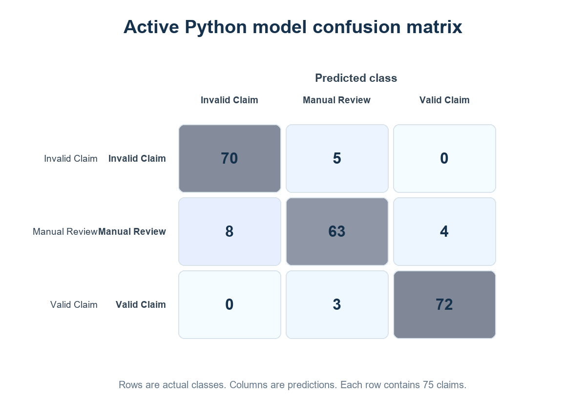
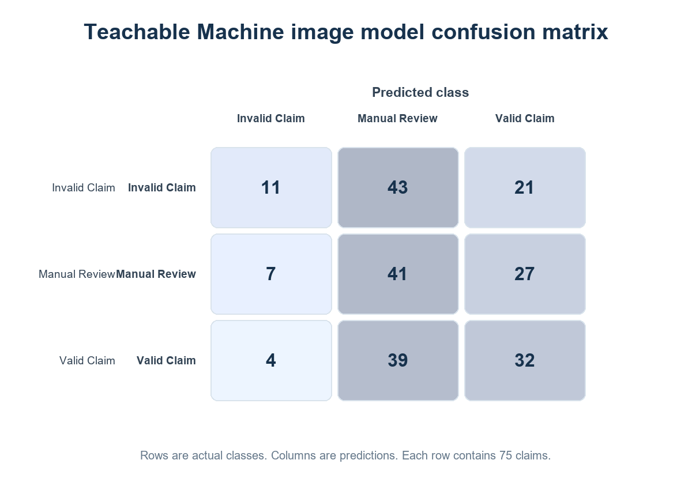

# Model Evaluation Report

**Evaluation date:** 2026-09-28  
**Dataset:** repository train, validation, and reserved test splits  
**Purpose:** document the active Python and Teachable Machine models, their behavior on the same unseen claims, and known limitations.

## Summary

The active Python classifier meets the SRS accuracy target on this prepared holdout set. The Teachable Machine export loads and returns three-class probabilities, but its measured accuracy is below the SRS target. The application integration works; image-model quality does not currently meet the required level.

| Measure | Python classifier | Teachable Machine image classifier | SRS target |
| --- | ---: | ---: | ---: |
| Held-out test claims | 225 | 225 matching cards | Unseen claims |
| Accuracy | 91.11% | 37.33% | At least 85% for each model |
| Macro precision | 91.07% | 41.11% | Report |
| Macro recall | 91.11% | 37.33% | Report |
| Macro F1 | 91.06% | 35.13% | Report |
| Prediction agreement | 37.78% (85/225) | same comparison | Compare both models |

The models disagreed on 140 claims. Of 225 comparisons, 18 were Strong Match, 9 Acceptable Match, 1 Weak Match, 57 Uncertain Result, and 140 Model Disagreement under the checked-in thresholds. Disagreement and uncertainty correctly route to human review.

## Dataset and method

The dataset contains 1,500 structured records, with 500 records in each class. It is split into 1,050 train, 225 validation, and 225 test claims. The test set has 75 claims per class. Each test CSV claim ID is matched to one image using `cards/card_manifest.csv`. The comparison ran all 225 corresponding test cards through the exported Teachable Machine model in a browser using local, vendored TensorFlow.js and Teachable Machine scripts. The test cards were not used for training.

The Python pipeline compares logistic regression, random forest, and extra trees and selects by validation macro F1. The active artifact was retrained with scikit-learn 1.8.0 and the saved schema; the selected logistic regression pipeline achieved 91.11% test accuracy. The test split was not used to select the algorithm. The exact active artifact hash is recorded in `models/model_metrics.json`.

## Python results

| Class | Precision | Recall | F1 | Support |
| --- | ---: | ---: | ---: | ---: |
| Invalid Claim | 89.74% | 93.33% | 91.50% | 75 |
| Manual Review | 88.73% | 84.00% | 86.30% | 75 |
| Valid Claim | 94.74% | 96.00% | 95.36% | 75 |

The Python model correctly classified 205 of 225 claims. Manual Review recall was 84%. Twelve of 75 Manual Review examples were assigned to another class, so the review workflow remains necessary.

## Teachable Machine results

| Class | Precision | Recall | F1 | Support |
| --- | ---: | ---: | ---: | ---: |
| Invalid Claim | 50.00% | 14.67% | 22.68% | 75 |
| Manual Review | 33.33% | 54.67% | 41.41% | 75 |
| Valid Claim | 40.00% | 42.67% | 41.29% | 75 |

The browser loaded `models/model.json`, metadata, weights, and all 225 held-out cards using the local runtime. It returned three probabilities per image and completed without a CDN request. However, the model classified only 84 of 225 images correctly. It predicted Manual Review for 123 of 225 cards. This is a measured accuracy failure, not a runtime loading failure. The available repo has the exported model and image cards, but not a Teachable Machine training project or its original training settings. Do not present this model as meeting the 85% target. Retrain in Teachable Machine using only the training split, tune against validation, then evaluate once on the reserved test split.

## Model comparison report

`reports/python_model_evaluation_2026-09-28/model_comparison_2026-09-28.csv` contains one row for each of 225 claims and includes the claim ID, true class, both predicted classes, all six class probabilities, card path, match status, top-confidence difference, consistency status, modeled warranty/evidence flags, scenario label, combined recommendation, and review reasons. `model_comparison_metrics.json` records aggregate metrics and artifact hashes. The agreement rate is 85/225, or 37.78%. The configured thresholds are in `config/decision.json`: minimum confidence 0.80; strong, acceptable, and maximum gaps 0.05, 0.15, and 0.25.

The offline rule flags use prepared test-row fields for warranty active state, fault coverage, reporting window, required-document count, serial match, duplicate flag, contradictions, and unauthorized repair. They are an evaluation of the combined decision logic over the prepared dataset, not created live application claims.

## Live model inputs and recording

For Python inference, `ml_service.claim_features` maps the current product, warranty, claim, verified documents, repairs, and policy findings into the exact 35-field ordered schema in `models/model_metrics.json`. `predict_and_store` rejects a mismatched order, constructs a one-row DataFrame, calls `predict_proba`, and validates the three class probabilities. The active file is `models/python_claim_classifier.joblib`, and the preprocessing pipeline is stored in `models/python_preprocessing.joblib`.

For image inference, the app renders a Claim Summary Card from claim facts, then the browser passes that image to the Teachable Machine export. The card omits the Python result and final decision. The browser posts the returned class scores to the application, which checks all three labels and persists the scores. Both model records include a content hash version.

## Important limitations and next steps

The dataset is balanced and split by claim ID, but its synthetic/scenario-generation provenance needs a fuller audit trail. Test scores do not establish real-world performance on manufacturer records, new policy types, or documents from different sources. OCR values require human verification. The 37.33% Teachable Machine accuracy is below the SRS target and must be corrected by retraining before claiming full SRS accuracy compliance.

The automated suite passes 37 tests, including active Python inference, the browser model assets and prediction-record endpoint, image OCR for all eight SRS receipt fields, text-PDF extraction, scanned-PDF and mixed-PDF OCR, and the application claim/review workflow. Load testing for 10,000 claims, verified inference latency under representative hardware, 99% availability, and cross-device browser review have not been measured.

## Reproducibility artifacts

- `reports/python_model_evaluation_2026-09-28/model_comparison_2026-09-28.csv`
- `reports/python_model_evaluation_2026-09-28/model_comparison_metrics.json`
- `reports/python_model_evaluation_2026-09-28/teachable_machine_test_predictions.json`
- `reports/python_model_evaluation_2026-09-28/tm_holdout_eval.html`
- `reports/python_model_evaluation_2026-09-28/tm_eval_server.py`
- `models/python_claim_classifier.joblib` and `models/python_preprocessing.joblib`
- `models/model.json`, `models/metadata.json`, and `models/weights.bin`
- `documentation/figures/`
