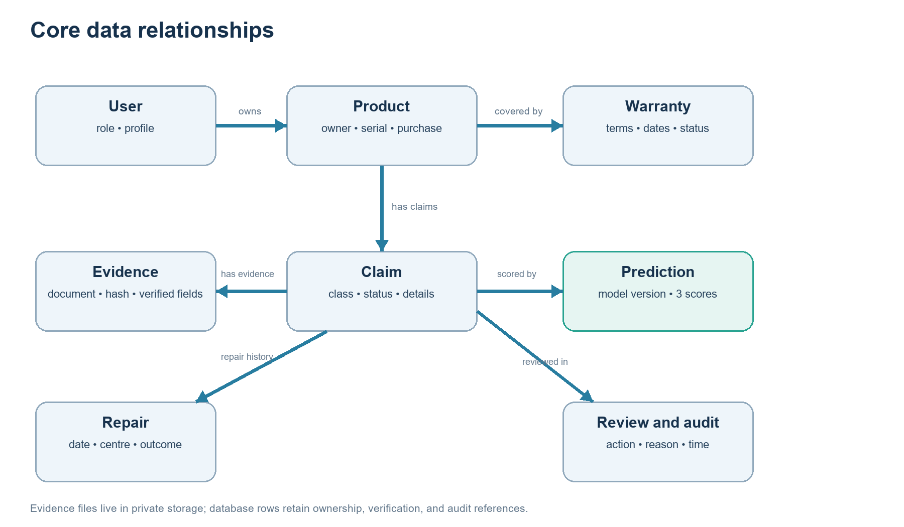
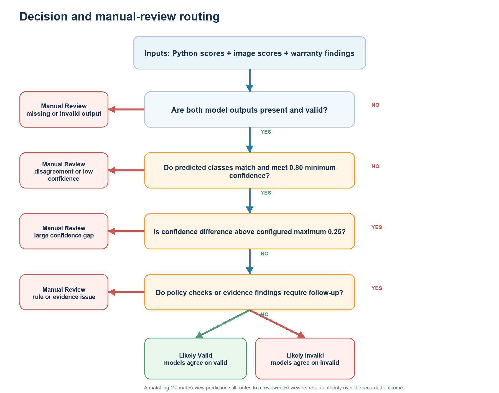

# AssureX Claim Engine Project Report

## Document purpose

This report describes the AssureX Claim Engine against the supplied Software Requirements Specification (SRS), Version 1.0. It explains the problem, scope, architecture, claim workflow, data model, dataset, machine-learning pipeline, warranty rules, security, test evidence, and known gaps. It separates implemented behavior from requirements that are present in the specification but do not yet have sufficient implementation or verification evidence.

The project is a decision-support application for warranty claim intake and review. It combines web forms, stored evidence, configurable policy checks, model predictions, and a human review workflow. A model output is a recommendation; an authorized reviewer records the claim outcome.

## 1. Problem definition and background

A warranty claim depends on related facts from different sources. These may include product information, purchase and warranty dates, the reported fault, the serial number, repair history, receipts, warranty cards, and policy conditions. Reviewing these details manually can be slow. Missing documents or conflicting values can be overlooked, and similar claims can receive inconsistent treatment.

AssureX brings those records into a single application. It gives customers a way to register products and create claims, and gives reviewers and administrators tools to examine evidence, policy checks, claim history, model results, and review actions. The SRS's three outcome classes are Valid Claim, Invalid Claim, and Manual Review. The application's final recommendation labels are Likely Valid, Likely Invalid, and Manual Review Required.

## 2. Purpose, scope, and boundaries

The project scope includes account roles, product and warranty records, claim intake, evidence uploads, document extraction and verification, repair history, policy checks, structured claim features, machine-learning support, decision comparison, reviewer actions, alerts, dashboards, search, reports, exports, and audit history.

The current repository does not connect to manufacturer systems, payment services, or enterprise warranty platforms. It uses SQLite for local development. The web server instructions are for local development and demonstration, not a production deployment.

The decision process depends on the information supplied by the user, the correctness of the policy JSON, and the quality of the dataset. Text extraction may fail or return incorrect values. The active Python classifier achieved 91.11% and the Teachable Machine image classifier achieved 37.33% on the same prepared test claims. The image model runs, but fails the SRS accuracy target.

## 3. Users and permissions

| User role | Purpose in the workflow |
| --- | --- |
| Customer | Maintains a profile, registers products and warranties, uploads evidence, prepares claims, and follows requests and status. |
| Service-centre employee | Works with customers assigned by an administrator, subject to route-level access checks. |
| Reviewer | Examines submitted claims, requests information, and records review outcomes. Reviewers cannot approve their own claims. |
| Administrator | Manages accounts, role assignments, customer access, policy settings, dashboards, and administrative review functions. |

Public registration is restricted to customer accounts. Administrators assign staff roles to other users. Role-based access is enforced by the application, and claim records are scoped to the signed-in user's permitted data.

## 4. System architecture

AssureX uses Flask and server-rendered templates. The application modules separate web routes and workflow operations from security helpers, claim services, feature mapping, and decision logic. SQLite stores application records. Uploaded evidence is stored separately in the configured upload directory. Policy terms and decision thresholds are read from JSON configuration files.

The Python model consumes a structured feature row assembled from the claim, product, warranty, verified evidence, repair history, and policy checks. The image classifier consumes a generated Claim Summary Card in the browser. The card is designed not to contain the Python model prediction or final decision. The application records each available model output with its version and compares the outputs before presenting the recommendation to a reviewer.

*Figure 1. Main application components and information stores.*

### Main software components

| Component | Responsibility |
| --- | --- |
| `app.py` | Flask application setup, routes, CLI commands, and integration points. |
| `workflow.py` | Claim and user workflow, validation, status transitions, reviews, reports, and policy operations. |
| `app_features.py` | Dashboard data and supporting application routes, including product evidence. |
| `claim_services.py` | Document validation, extraction helpers, policy access, and claim service functions. |
| `ml_service.py` | Feature mapping, Python inference, image prediction persistence, and model version records. |
| `decision_service.py` | Probability validation, confidence comparison, consistency state, final recommendation, and evaluation history. |
| `database/` | SQLite setup and SQL schema. |
| `templates/` and `static/` | Browser pages, styles, and JavaScript. |
| `models/` and `model/` | Active Python classifier, preprocessing, metadata, Teachable Machine export, and a model-directory guide. |
| `data/`, `cards/`, and `dataset_generator/` | Structured dataset, split/card mapping, image cards, and card utilities. |

## 5. Claim lifecycle

1. A customer account is registered and the user signs in.
2. The customer registers a product and records the applicable warranty.
3. The customer adds product documents such as receipts and warranty cards.
4. The customer creates a draft claim linked to the product and warranty.
5. The customer adds fault details, repair records, and claim evidence.
6. The application validates inputs, extracts text where supported, and displays values for verification.
7. The application checks warranty policy, required documents, serial evidence, duplicates, and contradictions.
8. Structured claim features are prepared for the Python classifier. The claim card is prepared for the image model when the browser runtime is available.
9. The application compares the model outputs and rule findings. Missing results and uncertain or conflicting evidence lead to manual review.
10. An authorized reviewer requests information, approves, rejects, or closes the claim. Actions and explanations are retained in claim history.
11. Users follow the claim through dashboards and notifications. Authorized users can generate reports and CSV exports.

*Figure 2. Claim processing path and decision support.*

## 6. Data model and data dictionary

The SQLite schema stores accounts, products, warranties, claims, documents, extracted and verified document values, repairs, predictions, model versions, evaluation results, rule findings, reviews, notifications, and audit records. Evidence files are stored in the upload directory and linked to database document records.

| Entity | Key fields and role |
| --- | --- |
| User | Unique user ID, name, email, password hash, role, and account status. |
| Product | Owner, product name, category, brand, model, serial number, purchase date and price, retailer, and warranty duration. |
| Warranty | Product link, type, provider, start and expiry dates, coverage details, and status. |
| Claim | Unique claim reference, owner, product and warranty links, fault date, fault category, damage type, description, requested amount, status, and final recommendation. |
| Document | Owner and product/claim links, evidence type, original and stored names, file type, size, content hash, and upload time. |
| Extracted document | Extracted text and values, user-verified values, verification user/time, and extraction state. |
| Repair | Product link, repair date, service centre, parts, outcome, cost, and authorization flag. |
| Prediction | Claim and model-version links, model type, predicted class, three class scores, top confidence, and creation time. |
| Model version | Model type, artifact hash/version, file identity, and activation metadata. |
| Evaluation | Claim, final recommendation, consistency state, confidence difference, reasons, passed checks, and prediction references. |
| Rule result | Claim, rule name, pass/warning/failure result, and human-readable detail. |
| Review and audit | Reviewer action, comment, actor, timestamp, and recorded workflow event. |

*Figure 3. Simplified entity relationships. The full field list is summarized above.*

The feature row includes categorical values such as category, brand, retailer, fault and damage types, last repair centre, and warranty status. Numeric and Boolean-like features cover prices, warranty duration, repair count, evidence availability, missing documents, serial match, duplicate and contradiction flags, dates converted to day counts, and claim-to-price ratio.

## 7. Dataset and preprocessing

The repository contains 1,500 structured records: 500 for each class. The split uses seed 42 and contains 1,050 training rows, 225 validation rows, and 225 test rows. The validation and test splits contain 75 records per class. The card manifest links claim IDs and class labels to image paths and train/validation/test splits.

Training cards have two image variations per training claim, resulting in 2,100 training images. The validation and test directories each contain one card for each of their 225 claims. Validation and test cards are kept outside the image-training folder.

The Python training pipeline applies median imputation and standard scaling to numeric features, and most-frequent imputation and one-hot encoding to categorical features. The exact feature order is stored with model metadata. `src/train.py` verifies required columns, unique record IDs, disjoint splits, and class presence before fitting models.

The current checkout includes the records, split mapping, and generated-card manifest. It does not include a complete, auditable description of the original full-dataset creation and labeling process. The team should record scenario definitions, label rules, source/provenance, and any synthetic-data generation process before presenting dataset quality as established.

*Figure 4. Class-balanced structured data and corresponding Claim Summary Card counts.*

## 8. Python model training and evaluation

The training script compares logistic regression, random forest, and extra trees. It calculates five-fold training cross-validation scores and evaluates candidate models on the validation split. Model selection is based on validation macro F1. The test split is held back until after selection.

A fresh run was completed on 2026-09-28 with the checked-in splits and the repository's current Python environment. Logistic regression was selected. Its validation accuracy was 89.78% and validation macro F1 was 89.85%. Random forest produced 87.11% validation accuracy and 87.11% macro F1. Extra trees produced 87.11% validation accuracy and 87.17% macro F1.

The selected model achieved 91.11% accuracy on 225 test claims. Macro precision was 91.07%, macro recall was 91.11%, and macro F1 was 91.06%. Each class had 75 test records. The full metrics, source-file hashes, model artifact, preprocessing artifact, and per-claim predictions from the fresh run are saved under `reports/python_model_evaluation_2026-09-28/`.

*Figure 5. Validation accuracy and macro F1. The held-out test score is shown separately after selection.*

### Test confusion matrix

| Actual class | Predicted Invalid | Predicted Manual Review | Predicted Valid |
| --- | ---: | ---: | ---: |
| Invalid Claim | 70 | 5 | 0 |
| Manual Review | 8 | 63 | 4 |
| Valid Claim | 0 | 3 | 72 |

The model correctly classified 205 of 225 test claims. Manual Review recall was 84.00%, with 63 of 75 manual-review records correctly identified. The remaining manual-review records were predicted as invalid or valid. This is a reason to preserve a human-review route and to evaluate class-specific outcomes rather than relying on overall accuracy alone.

*Figure 6. Rows are true labels and columns are predicted labels.*

*Figure 7. Class-wise test metrics, with 75 records in each class.*

*Figure 8. The image model is below the SRS target on the prepared holdout set.*

*Figure 9. Teachable Machine predictions for the 225 held-out cards.*

*Figure 10. The two classifiers disagree or produce uncertainty on most test claims.*

### Active Python model identity

The active model is the validation-selected logistic-regression pipeline at `models/python_claim_classifier.joblib`, trained using scikit-learn 1.8.0. `models/python_preprocessing.joblib` and `models/model_metrics.json` are from the same training run. Its SHA-256 artifact hash is stored in the metadata. The trained pipeline includes imputation, scaling, categorical encoding, and classification; live input columns are validated against the saved ordered schema.

## 9. Teachable Machine image model

The image classifier uses the TensorFlow.js export in `models/model.json`, `models/metadata.json`, and `models/weights.bin`. The metadata reports three labels and a 224-pixel image input. The application code loads the model in the browser and sends its scores back to the claim workflow. The Claim Summary Card renderer is in `dataset_generator/render_cards.py`.

The image model and its locally bundled browser runtime produced all three class probabilities on each of the 225 reserved test cards. It achieved 37.33% accuracy, 41.11% macro precision, 37.33% macro recall, and 35.13% macro F1. This does not meet the SRS requirement of at least 85% accuracy. Its confusion matrix shows frequent false Manual Review predictions.

The model runtime and application integration are operational. The exported image model needs retraining and a new holdout evaluation. The repository contains the card dataset and exported weights, but not the original Teachable Machine project or training configuration. Do not describe the model as meeting the target until it has been retrained on training cards only, selected using validation data, and evaluated once on the held-out test cards.

## 10. Comparison and decision logic

For two valid prediction records, the application checks whether the predicted classes match and computes the absolute difference between the top-class confidence values:

**Difference = |Python top-class confidence - Teachable Machine top-class confidence|**

The decision configuration sets a minimum confidence of 0.80. The configured confidence-difference thresholds are 0.05 for Strong Match, 0.15 for Acceptable Match, and 0.25 as the maximum allowed difference. A disagreement is labeled Model Disagreement. Insufficient confidence or missing/invalid output is Uncertain Result. Matching and sufficiently confident results are assigned a consistency label according to the confidence gap.

On the 225 held-out claims, the models agreed on 85 (37.78%) and disagreed on 140. The saved comparison file includes six class scores per claim, top-confidence difference, rule/evidence flags, consistency status, recommendation, and review reasons. Under the configured thresholds, 18 pairs were Strong Match, 9 Acceptable Match, 1 Weak Match, and 57 Uncertain Result.

A consistency label does not decide the claim by itself. Rule findings, missing required evidence, duplicates, contradictions, and other issues can still send the claim to manual review. The decision service returns Likely Valid or Likely Invalid only when the model evidence is available and the rule findings do not create unresolved reasons. Otherwise the result is Manual Review Required.

*Figure 12. Configured model and rule gates route uncertain claims to manual review.*

## 11. Warranty rules, documents, and integrity checks

Three separate sample policy JSON files cover Laptop, Smartphone, and Appliance. The policies configure coverage months, reporting periods, covered faults, exclusions, mandatory evidence types, authorized repair conditions, grace days, and rules for warnings or manual review. Unknown categories are not automatically treated as covered.

Evidence formats include PDF, JPG/JPEG, PNG, and MP4, subject to configured validation and size limits. Text-based PDF extraction uses `pypdf`. Image and scanned-PDF OCR use `pytesseract` and a locally installed Tesseract executable. Text is extracted page by page; the first five pages without selectable text are rendered with PyMuPDF and passed to OCR, including pages in mixed text/scanned PDFs. Extracted fields are shown for user verification rather than being accepted silently. Broad receipt-layout accuracy is not established.

The application checks possible duplicate claims using product or serial associations and detects exact duplicate files with a content hash. It checks selected contradictions, including dates and differences between verified document values and registered product data. The checks do not implement every duplicate signal listed in the SRS, such as invoice-number and fault-description similarity across all claimants. This is recorded as a partial requirement in the compliance matrix.

The policy structure uses three configurable files, one for each supplied product category, satisfying the SRS file-count requirement.

## 12. Security and privacy

The application includes password hashing, CSRF protection, login throttling, role checks, upload validation, private file serving, session-secret configuration, and audit history. It avoids placing uploaded customer evidence or the local SQLite database into version control through ignore rules.

These safeguards do not establish compliance with a particular privacy law or prove production readiness. The current local setup uses SQLite and Flask's development server. The SRS performance, scalability, responsive-use, and availability targets have not been measured in this review. Production use would need an appropriate WSGI server, a managed backup and retention plan, monitoring, access controls, TLS termination, and organization-approved privacy practices.

## 13. Test evidence

`documentation/TEST_RESULTS.md` records 37 passing automated tests from 2026-09-28. The documented coverage includes accounts and roles, CSRF, claim and warranty dates, documents, PDF text extraction, Tesseract image, scanned-PDF, and mixed-PDF OCR, verification, duplicate and contradiction checks, repairs, notifications, policy snapshots, filters, reviewer transitions, overrides, evaluation history, and confidence consistency logic.

The expanded test suite passed during this review. Browser inference was separately completed on all 225 holdout cards. The local scripts for Bootstrap, TensorFlow.js, and Teachable Machine are vendored under `static/vendor/`, so the application UI and model do not depend on those CDNs at runtime. These results are not evidence of real-world OCR accuracy, 10,000-claim performance, 99% availability, or mobile browser usability. Those targets still require separate evidence.

## 14. SRS traceability and open work

The detailed requirement-by-requirement status is in [`MODULE_REVIEW.md`](MODULE_REVIEW.md). The most significant outstanding items are:

- Retrain the Teachable Machine image model using training cards only, select settings from validation results, and reevaluate the reserved test cards. The current test accuracy is 37.33%.
- Review the saved 225-claim comparison report and use its disagreement records to investigate image-model failures.
- Keep the active Python classifier, metadata, preprocessing artifact, scikit-learn dependency, and test report versioned together.
- Record the dataset's provenance and scenario/label generation process.
- Decide whether the policy deliverable needs three distinct files rather than three categories in one JSON file.
- Add test evidence for five-second single-claim predictions, 10,000-claim scale, responsive layouts, and 99% uptime.
- Add the required demonstration video, deployment details if available, evaluator sample login details through a safe channel, and team contribution evidence.

## 15. Installation and use

The root `README.md` documents first-time Windows CMD setup, the virtual environment, dependency installation, database initialization, administrator creation, startup, role setup, product registration, warranty entry, claim preparation, document verification, model behavior, exports, and test commands. The local application is started with `.venv\Scripts\python.exe app.py` from the repository directory and opened at `http://127.0.0.1:5000`.

## 16. Project file guide

| Folder or file | Purpose |
| --- | --- |
| `app.py`, `workflow.py`, `app_features.py` | Flask setup and web workflow. |
| `claim_services.py`, `ml_service.py`, `decision_service.py` | Evidence and policy services, feature mapping and model storage, evaluation logic. |
| `database/` | SQLite schema and database helpers. |
| `templates/`, `static/` | User interface templates, styles, and browser scripts. |
| `policies/`, `config/` | Separate category policy files and decision thresholds. |
| `data/`, `cards/`, `dataset_generator/` | Structured records, split/card manifest, claim cards, and card rendering. |
| `models/` | Python model and Teachable Machine exports plus metadata. |
| `reports/python_model_evaluation_2026-09-28/` | Python training outputs and complete 225-claim Python/image model evaluation and comparison records. |
| `documentation/figures/` | Diagrams and plots used in the report and blog. |
| `tests/` | Automated test suite. |
| `documentation/` | SRS review, test record, development log, and technical blog. |

## References

- *AssureX Claim Engine Software Requirements Specification, Version 1.0, Aptech Limited.*
- [Project README](../README.md)
- [Module review and SRS status](MODULE_REVIEW.md)
- [Test results](TEST_RESULTS.md)
- [Development log](DEVELOPMENT_LOG.md)
